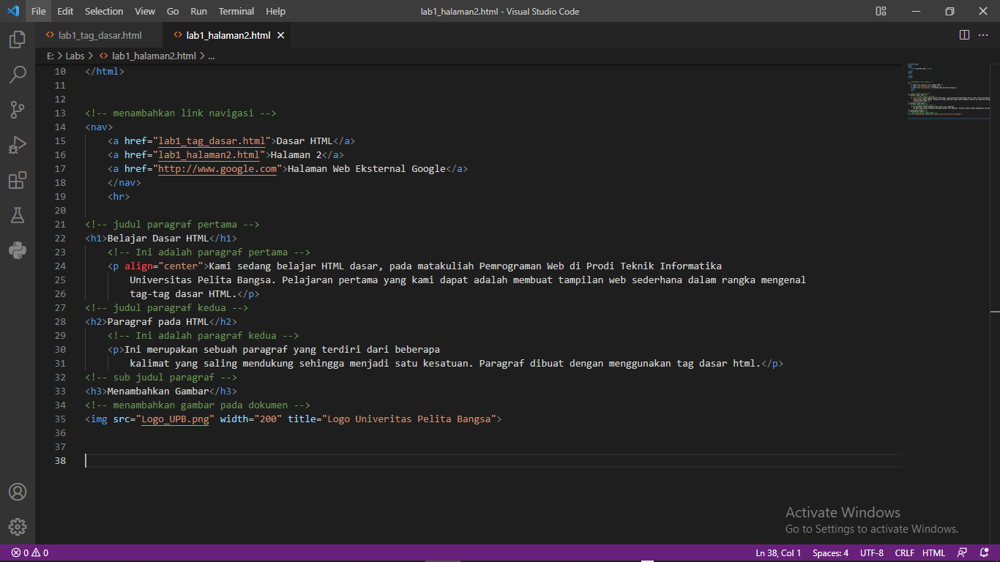
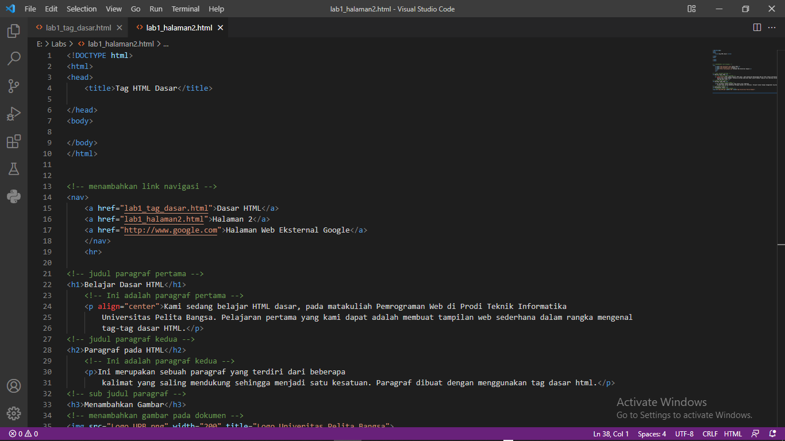
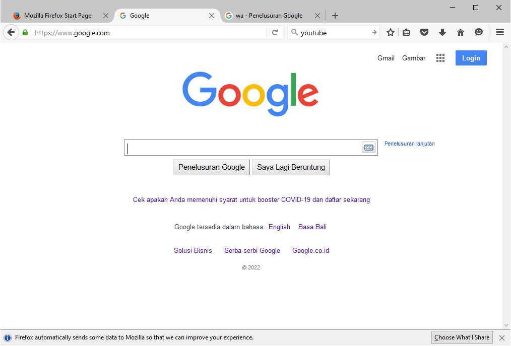
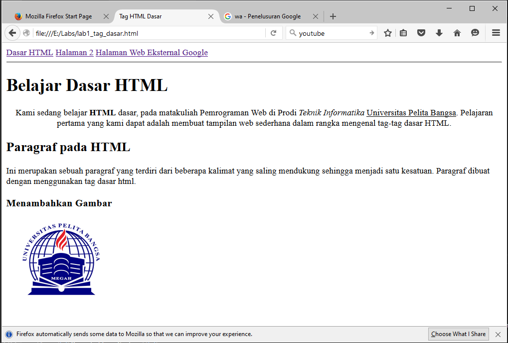
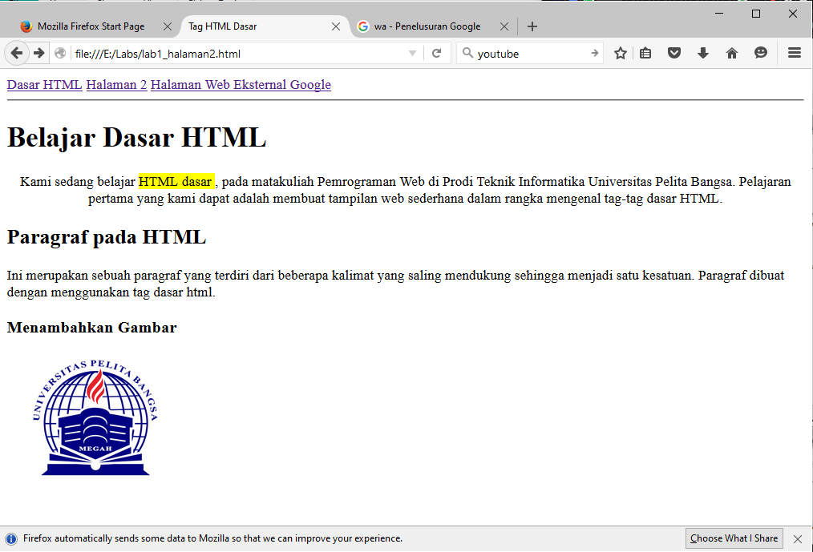

# Web1Lab1
## Belajar Tag Dasar HTML

### Membuat Paragraf
kode tag untuk paragraf adalah '(p)'
ini adalah tampilannya

  
  
  
  
  
  Jawab Pertanyaan Berikut
1. Lakukan perubahan pada kode sesuai dengan keinginan anda, amati perubahannya adakah
error ketika terjadi kesalahan penulisan tag? 
Jawab : Ada , tapi saya cepat perbaiki. 

2. Apa perbedaan dari tag (p) dengan tag (br), berikan penjelasannya! 
Jawab : (p) adalah code untuk menambah paragraf 
	      (br): break-line (untuk berpindah ke baris selanjutnya)

3. Apa perbedaan atribut title dan alt pada tag , berikan penjelasannya!

Jawab : title pada tag  berfungsi sebagai memberikan judul pada gambar dan judul / title akan tampil jika cursor kita arahkan pada gambar.Sedangkan parameter alt pada tag  berfungsi juga sama pada parameter title, hanya saja parameter alt ini akan di tampilkan jika gambar gagal dimuat.

4. Untuk mengatur ukuran gambar, digunakan atribut width dan height. Agar tampilan gambar
proporsional sebaiknya kedua atribut tersebut diisi semua atau tidak? Berikan penjelasannya!
Jawab : Tidak cukup Width saja yang di isi . 

tribut width menentukan lebar gambar sedangkan atribut height untuk mengatur tinggi gambar.
pada contoh diatas ukuran lebar ( width ) sebesar 100 dan tinggi ( height ) sebesar 100. secara default ukuran satuan width dan height adalah px ( pixel ) jadi lebar 100px dan tinggi 100px. 

5. Pada link tambahkan atribut target dengan nilai atribut bervariasi ( _blank, _self, _top,
_parent ), apa yang terjadi pada masing-masing nilai antribut tersebut?
Jawab :
_blank untuk membuka link di tab baru
_self untuk membuka link di frame link itu berada. ini merupakan setelan dasar link jika pada elemen link tidak diberi atribut target
_top untuk membuka link di frame paling atas (paling luar).’
_parent untuk membuka link di frame yang satu tingkat di atas frame link tersebut berada.

  

  
  
  
  
  
  
  
